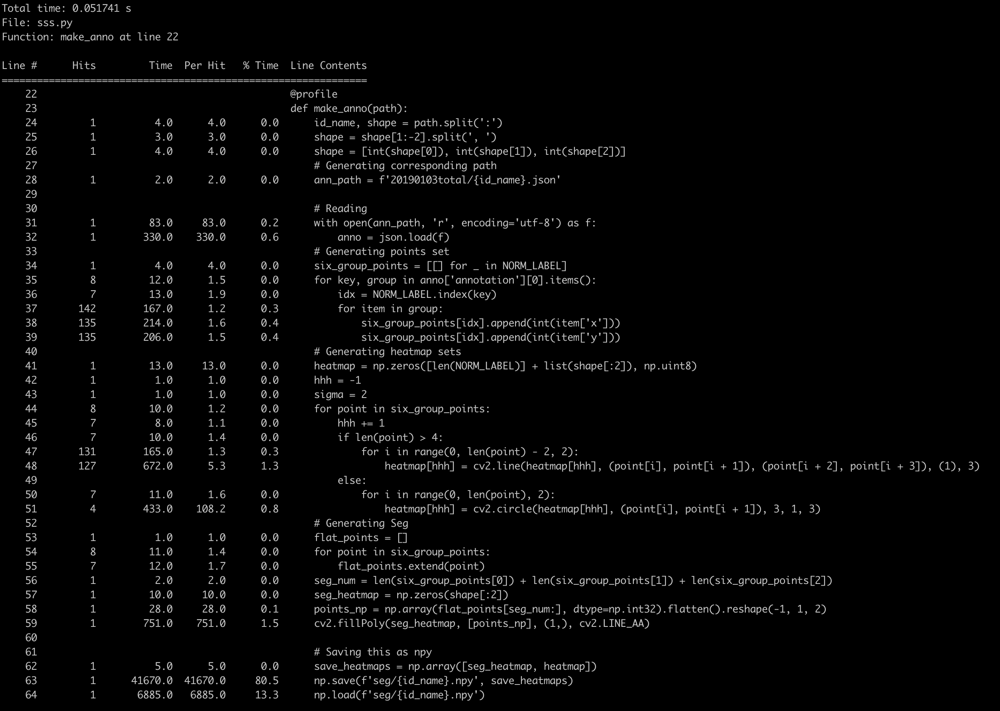
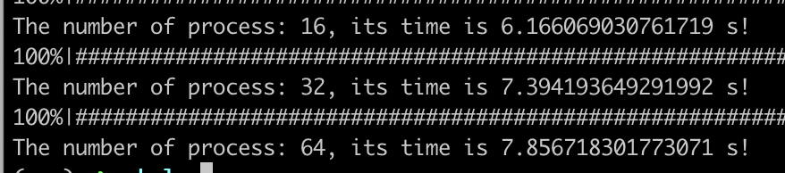
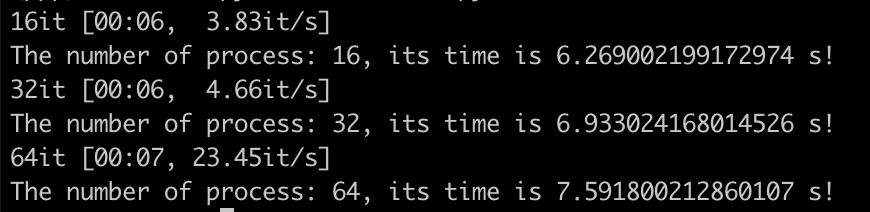

# optim
## Multi-process + Decorator
Run time analysis：Bottleneck in IO
```
isPreProcess = False if ioTime <= processTIme else True
bestNumWorker = kernelNum (not the hyperthreading in INTEL CPU)
```

MP ver 1

MP ver 2

